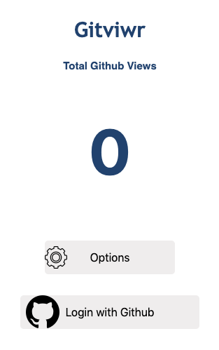

</img>

# Gitvwr

### Overview
Gitvwr is a lightweight, secure, and real time chrome extension that notifies users via email when their Github profile has been viewed(LinkedIn style). 

### Engineer(s)

* **Medi Assumani** - *Full Stack Developer*

### Project Built With

* Front End : HTML, CSS, Javascript, Reeact
* Back End : Node.js, Express.js, Socket.io, NodeMailer, Github OAuth, JWT
* Database : MongoDB

### License

This project is licensed under the Apache 2.0 License - see the <a href="https://github.com/MediBoss/Lofti/blob/master/LICENSE">LICENSE</a> file for details

### Screenshots

</img>
### Acknowledgments

* Major Hat tip to <a href="https://github.com/bnguyen212">Brian Nguyen</a>
* <a href="https://github.com/matthewlawson">Matt Lawson</a> for his amazing talk on chrome extenion.
* <a href="https://github.com/RinniSwift">Rinni Swift</a> and <a href="https://github.com/woodward4422">Noah Woodward</a> for being my Beta Testers.
* Stack overflow

### ToDO

- [x] Improve PopUp view with Boostrap and React on Front End
- [x] Integrate Database(MongoDB) Query
- [x] Migrate to SOA architecture on Back end
- [ ] Review project rubric
- [x] Add user Auth on Backend
- [ ] Deploy to chrome store
- [ ] Add socket broadcasting for multiple clients.
- [x] Declutter app.js and add routes.
- [x] Add Real time views counter on client 
